# QT-19 build notes
If you have questions, or feel like there are improvements that I can make, feel free to message me, I'm always looking to improve!

## 1. Overview
I've been fond of toruk/torukmakto4's HyCon/T19 (T19 is a blaster, HyCon is a specific brushless cage) project for a while now, for the following features:
- Brushless outrunner mounting pattern
- Closed-loop RPM control (controller feedback via Flyshot fork)
- High-inertia flywheels
- Aggressive groove filler cage

The project is largely documented in toruk's blog: https://torukmakto4.blogspot.com/

I've decided to make a personalised variant of this (Dubbed QT-19 because I think it's cute aesthetically) including the following changes:
- Solenoid pusher 
    - IMO the mental feedback from the solenoid firing helps with usability
- Worker Half darts (Ammo carrying capacity + compatibility with local community)
- Narfduino board
    - Created by AirzoneSama (https://github.com/airzone-sama, https://www.youtube.com/@AirzonesBlasters)
    - This seemed like the easiest and oddly enough, most affordable means of getting my hands on SimonK compatible ESCs
    - Extremely convenient wiring, half bridge, Flyshot flashing and everything handled
- Step away from brutalist aesthetic for personal taste
- (Other gimmicky shit that got abandoned)

### 1.1 Note on other similar builds
Since completing this project to a workable state, however, the T19E2 release may be underway, and at a glance, I would highly recommend considering certain other similar builds over my QT-19 project, they seems like more solid takes on the half-dart solenoid concept from a construction standpoint. Hopefully, however, there might be some parts in my work that might be of use to you.

Other similar T19-like builds:
- u/dpairsoft's Hy-Con Gryphon
    - https://www.reddit.com/r/Nerf/comments/110whqd/newest_addition_to_my_collection_neutron_solenoid/
- u/airzonesama's HyCon Caliburn 
    - https://www.reddit.com/r/Nerf/comments/f1izp3/full_auto_caliburn/
- u/justusUMBC's "Spirit"
    - https://www.printables.com/model/451651-spirit-a-brushless-flywheel-dart-blaster
- u/airzonesama's HyCon Caliburn
    - https://www.youtube.com/watch?v=K4VExc-QwSc

## 2. Components
List of components I used, note that they are not necessarily the ideal parts in each case. YMMV with your personal budget constraints and supply chains.

### 2.1 Motors:

  
  
iFlight Xing-E Pro 2306

This motor I mistakenly purchased is not among Toruk's HyCon recommendations primarily due to the bell shape - not ideal, but serviceable. I've personally not observed any issues with it after fielding it for a few games, even with mediocre 3D prints. Even in this case, I've found it to feel smoother/more precise than conventional press-fit brushed flywheel shafts.

### 2.2 Controller(s):
I used the Narfduino ESC Compleat motor from AirzoneSama, you'll likely have to contact him
directly to purchase one.

Here is a link to his website, the documentation should be mostly available here: 
https://blastersbyairzone.com/hardware/narfduino/

Note that this is arguably the "throw money" at the problem solution, as I'm given to understand that this is pricier than sourcing individual component directly, but my goodness was it nice to only have to solder the motors/switches/display/power into one broken-out, half-bridge-ready, pre-flashed board.

### 2.3 Battery:
I'm using a 3S for now, but the system is supposed to run on 4S. I'm not familiar with the issues of running on 3S (Aside from weak solenoid throws, and potential issues sourcing high-capacity batteries), but toruk has hinted at encountering other issues relying on motors with high kV to compensate for the lower voltage.

I've also noticed that it's easier to source batteries with higher capacity as we go to 4S, and the higher voltage will likely allow for more solenoid reliability (more force, reduces time required to push darts).

Make sure to source a battery with a reasonably high max current output to facilitate the solenoid and large brushless motors; solenoids tend to drain a surprisingly high current. 

Be sure to also either select a small enough battery or large enough alternative stock to contain said battery. The T19/QT19 battery stock is fairly large, though, so I suspect that you will have little trouble with this.

### 2.4 Solenoid pusher:
This generic solenoid I used was 13.27USD, whereas a Neutron solenoid is around 30USD and a FTW Hyperdrive is around 35USD.

  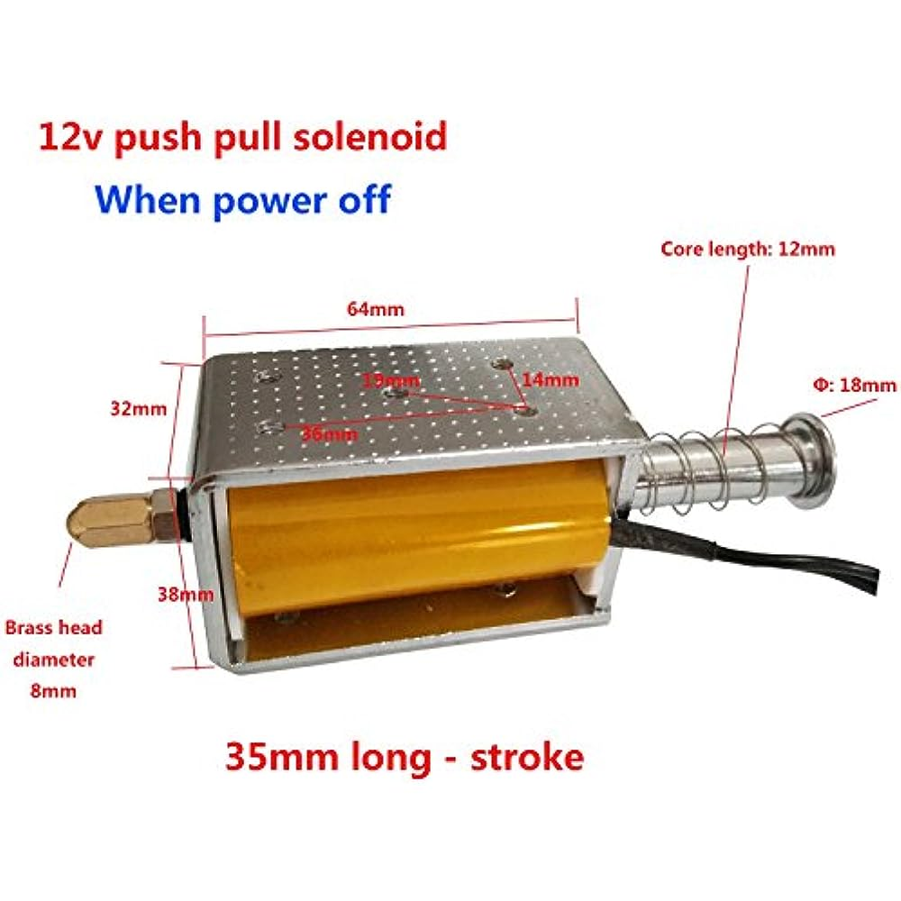
  
Generic 35mm stroke solenoid

I found that the total available stroke length was less than I had hoped, having only about 30mm.

One also has to cut down a stock retaliator spring (or something similar) to replace the stock solenoid spring to create enough back-force to not get stuck on darts. Skimming over the r/Nerf discord, it looks like the Ace/Hillman #94 might be promising, but I'd recommend doing your own research before purchasing a solenoid/return spring setup.

Alternatively, I'm given to understand the Nerf-specific solenoids tend to be stronger and potentially longer stroke than the generic 35mm, so there's some incentive to go down that potentially less-troublesome route. 
I'm not sure if the mounting patterns for these purpose-built solenoids are the same as the generic 35mm, but if so, it'd be nice not to have to source and mess around with turning a generic.

### 2.5 Screen:
White 128x64 OLED Display Module for Arduino 0.96"

### 2.6 Screws:
This blaster is assembled with a thrown-together assortment of M3 and M4 SHCS screws. I apologise that I have not kept track of the lengths. 

- The stock and solenoid are held together with M4, everything else is M3. You should be able to get away with firstly an assortment of SCSH such as this: 
    

        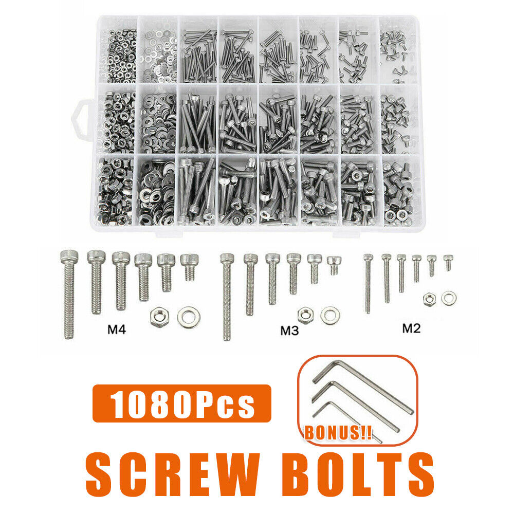
        
e.g. https://www.ebay.com.au/itm/403461691176

    

- I also had to purchase sets of M3x25 and M3x35 SHCS to hold the receiver together.

## 3. STL files
We're going to use a combination of the original T19 files and my QT19 variant files. There is some small amount of wiggle-room for part customisation.

### 3.1 Original T19 files for toruk's build:
I'll continue keeping an eye on toruk's github repositories here for when he eventually uploads: https://github.com/torukmakto4.

Until then, the T19 files are available here: https://drive.google.com/drive/folders/1cfsm5mGHDXkl9gdmkl7Z_lcq5yUasON_?usp=sharing

### 3.2 QT19 files/changes
I've split my files into these folders:
- Cages
    - There are a number of cage variations here that I trialled that you could potentially choose from.
    - The cage cover also has an additional cutout to accommodate the overhang with the magwell
    - There is also an underbarrel rail that is compatible with the shaft holes in the BR2207S files – I found that the shafts stuck out a little bit past the cage cover, so I had to add covering features to the rail accommodate that. There is also a diagonal block that fills in magwell - necessary due to the overhang.
- Grip
    - 

        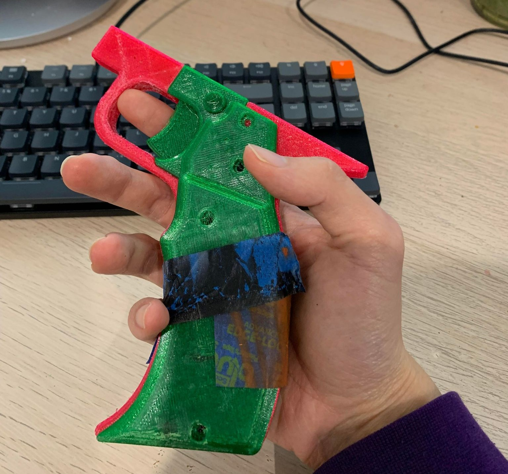
        
QT19 grip assembly

        

    - In addition to the curved shape, the QT19 grip also includes space for a mag release switch that acts as a spring/reload detection.
- Magwell/breech
    - The magwell has been altered to fit the solenoid receiver. I’ve shifted the cage placement over the magwell to compensate for the lower stroke length of the 30mm solenoid, this indents the top segment backwards, placing the wheels closer to the magazine feed. The wheels don’t really grip the darts until they are somewhat into the cage, so we should be able to get away with the cage slightly overhanging the magwell.
    - 

        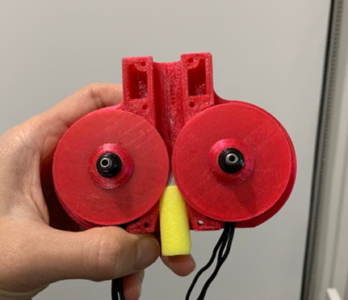
        
Demonstration of where the dart starts to feed into the cage

        

    - I’m using the Narfduino board with integrated ESCs, so bulges on the side for ESCs are not necessary. In retrospect though perhaps I should've left some space to allow for hardware versatility.
- Receiver
    - This required a longer, narrower receiver shape, and M4 SHSC on the side when compared to the original T19 due to the shift from NEMA17 steppers to solenoid.
    - Shape changes also due to shift to the Narfduino controller board.
- Stock
    - The main stock body, QT19_Stock can be swapped out with the original T19_Stock.
    - The eyelet piece was because I didn't have any M6 bolt to mount the stock to the "buffer tube" component
    - Note that I’ve used the sling mount from the Gryphon (another printed blaster available here: https://github.com/Flygonial/The-Gryphon-Foam-Dart-Blaster), this needs to be scaled up by 28% as the buffer tube is larger in this build.
- Top covers
    - In general I didn't print top covers, I ended up just using some polycarb sheet cutout based on "polycarb_cover_cutguide.stl", so take these files with a grain of salt (You might have to design/redesign your own, sorry :c )
- Unused
    - GUI sight
    - Charging handle/nub
    - Short breech (no undercut)

  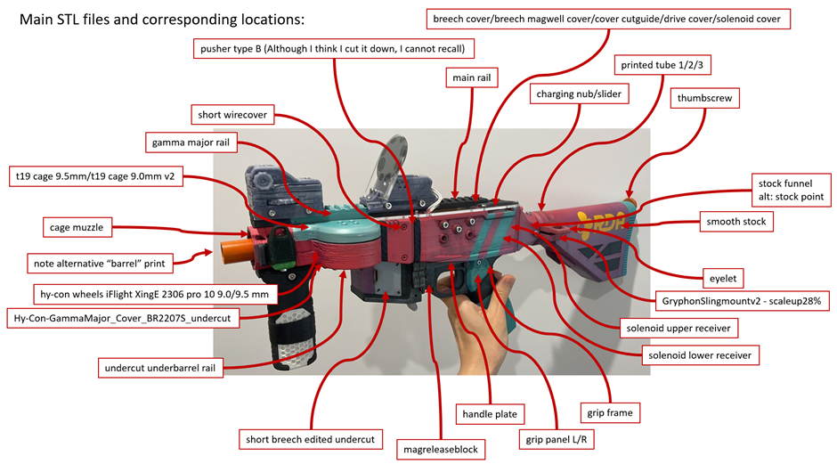
  
QT19 part breakdown (Note: This diagram is a little dated, but gives an approximation of the parts).

Note: Depicted here are these attachments:
- "Shade vertical foregrip" https://www.thingiverse.com/thing:3892164 
- "Quick point sight - Open" https://www.thingiverse.com/thing:4887523

### 3.3 Combining the two sets of files
I intended to keep some cross compatible files, but everything spiralled/scope creeped out of control, leaving only the cage cross-compatible. This is one reason why I'd recommend considering looking at one of the other hybrid builds, particularly the gryphon-HyCon platform. I feel that using an established platforms may provide a more mature foundation for modularity with other existing designs.

Firstly, you'll need these T19 files that are the same across both versions:
- Ribbed stock butt plate 
    - T19E1/Common/STL/T19_ButtplateCurved
- Grip rotation piece
    - T19E1/Common/STL/T19_GripFramePivotPlate
- Mag release 
    - T19E1/Common/STL/T19_ShortMagRelease
- Trigger 
    - T19E1/Common/STL/T19_Trigger

However, you'll note that I've also added some personal alternatives to the mag release and trigger, feel free to use either version.

Then, you'll need to grab all of the QT19 files, with the exception of the cage setup, which will be largely dependent on the motors you are running (sourcing can be somewhat unreliable).

#### 3.3.1 Navigating the HyCon cage files
Depending on the motors that you source, you will need a cage setup of some sort, likely from the original T19 folder, or potentially  from the QT19 ones.

There are 3 different cage types in the T19 drive:
- Common - original cage (See above).
- Delta - Long cage 
- GammaMajor – Short cage. I believe this is similar to the common cage in appearance, but has a few added features like truncated groove fillers, which also present in the Delta cage.

In the repository you will find cages for these motors:
- Emax RS2205S
    - E.g. Crazepony 4pcs EMAX RS2205 2600KV Brushless Motor 3-4S 2CW 2CCW for QAV250 QAV300 FPV Racing Drone Quadcopter on Amazon.
- iFlight-XingE 2207/2306 (non pro)
    - Don't mix these up with the bell-shaped iFlight 2pcs XING-E Pro 2306 2450KV, which I made the mistake of doing – I've posted my own flywheels which fit these.
- Racerstar-BR2207S
    - These seem somewhat accessible, I think they're the same one used in other brushless builds like the ultrastryfe, I seem to see them in abundance on eBay, Aliexpress and Banggood. Reports seem to suggest that they are functional options, but don't have the same build quality as other motors that have been recommended for the T19.
- Turnigy
    - These refer to the Turnigy Multistar V-Spec 2205 2350kv, and as far as I can tell, aren't available anymore, you'll likely have to get your hands on alternatives
- Blanks (For fitting your own motors)
    - There are standard sizes to brushless motors (https://www.phaserfpv.com.au/blogs/fpv-news/what-is-the-difference-between-1804-vs-2204-vs-2205-vs-2006), so I suspect that 2205/2207/2306 would fit in the cages, potentially with some light CAD work.

Because there's variation between motors, you will have to make your own file edits for your specifications. For instance, if you want to use spacing other than the standard 9mm or 9.5mm, or if you want to use the iFlight motors with a cage cover compatible with the lower gamma rail. Depending on your FreeCAD/STL editing skills, it may be worth digging through the files before sourcing motors. Don't worry though, the wheels are relatively straightforward geometrically speaking:

  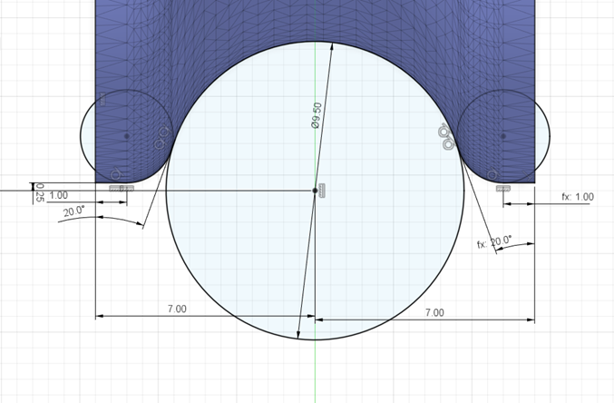
  
Flywheel contact profile that you can build off from - note that the 20 degree angle was chosen to accomodate my printer's overhang limit of 70 degrees, adjust accordingly 

#### 3.3.2 QT19 cage files
I've added a few cages for the iFlight XE Pro motors I'm using. 

I've added a cover over the motors in the main body for safety for some of these, but I'm likely abandoning that change, turns out trying to clamp the cage is less ergonomic than using a vertical foregrip.

I'm using a variation of the HyCon system that includes rifling inserts - Work on the system is ongoing here:
https://github.com/GrubbyLittleRaccoon/HyCon_muzzleinsert

If you're not interested in the rifling insert, and you use a different motor, you should be able to substitute the motor mount section of the cage with whichever of Toruk's cages you're after.
To make this compatible with the QT19 system you can pair this with:
- Cages/Oldcages/Hy-Con-GammaMajor_Cover_iFlightXE_PRO_undercut.stl

### 3.4 Assembly notes
Prior to building a QT-19, look over Toruk's T19 assembly guide, master post here: https://torukmakto4.blogspot.com/2019/01/t19-build-guide-part-1-3d-printed-parts.html

My document only roughly covers the variations I've made, but is still centred around the T19 foundation, which has assembly documented in significantly more detail.

Note:
- Hole size -The SHSC used are M3 for the most part, some M4 near the back + solenoid mounting.
- The stock is held together with M4, everything else is M3.

#### 3.4.1 Grip
The QT19 fileset has a spaced/spacer trigger as an alternative to the T19 - feel free to use either depending on your preferences. The original T19 relies on devcon to glue the pivot plate to the handle handle, and an SHCS with a smooth shoulder, whereas the QT9 adds a spacer that allow you to get away with using regular SHCS, and is more forgiving of overtorquing, which would otherwise cause the original T19 to jam.

    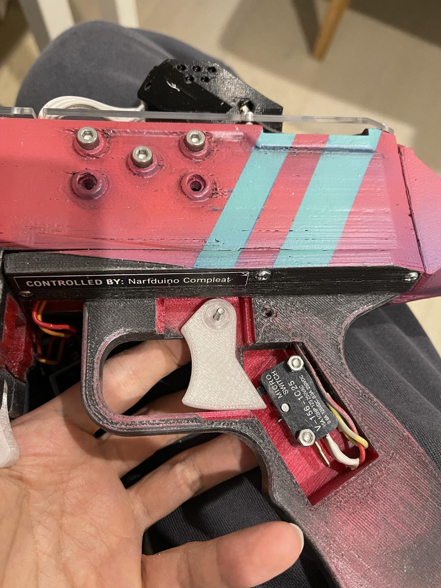
    
QT19 trigger with spacer

I found it difficult to get the handle in the handle plate while aligning it, I found clamps to assist after partially bolting it in somewhat helpful

    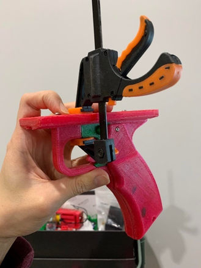
    
Failed charging handle component

#### 3.4.2 Magwell/Breech
Similar to the trigger, the QT19 fileset has a mag release with a spacer to be more forgiving of overtorquing.

    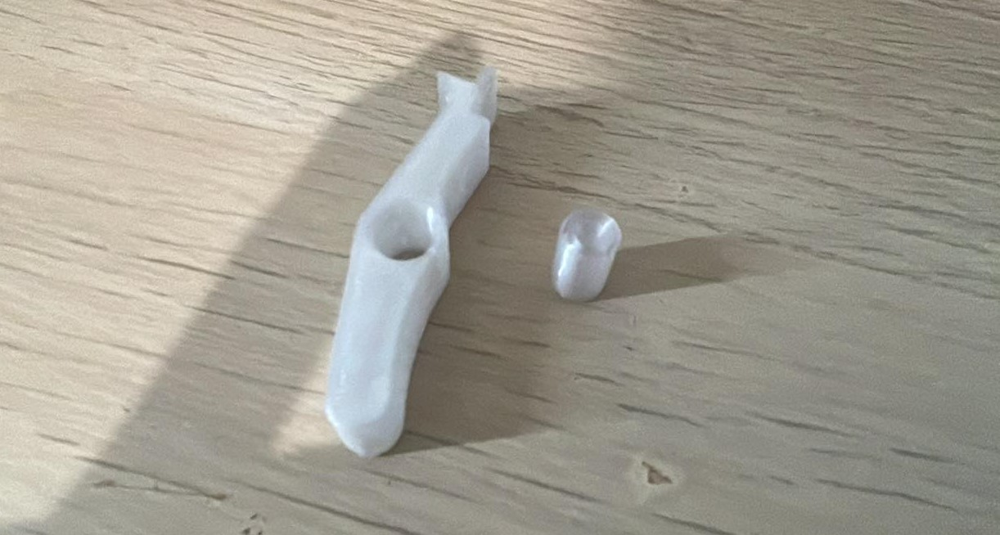
    
QT19 trigger with spacer

#### 3.4.3 Receiver
The switch holder for the magazine release is a little awkward to assemble. Tackle this only after you attach the trigger plate to the receiver.

Firstly, mount the switch inside the holder/bracket. I've done this using 4x M3x8 SHSC, which probably isn't the best way to handle these switches, feel free find a better way to do this.

I've used two switches despite only wiring one up to supply additional force to the mag release lever.

    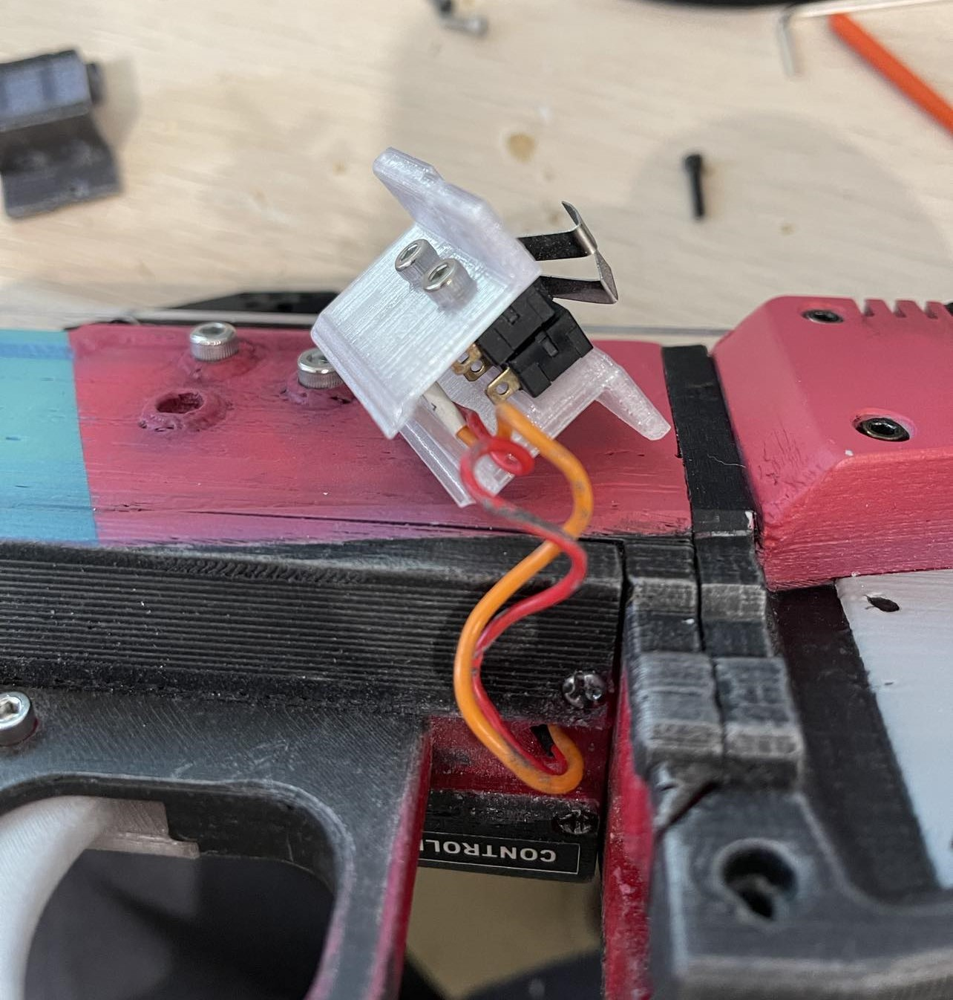
    
Mag block with switches inserted

Then push it down slowly, and to avoid the wires sticking out, I tucked them in with a flathead screwdriver as I pushed down. 

    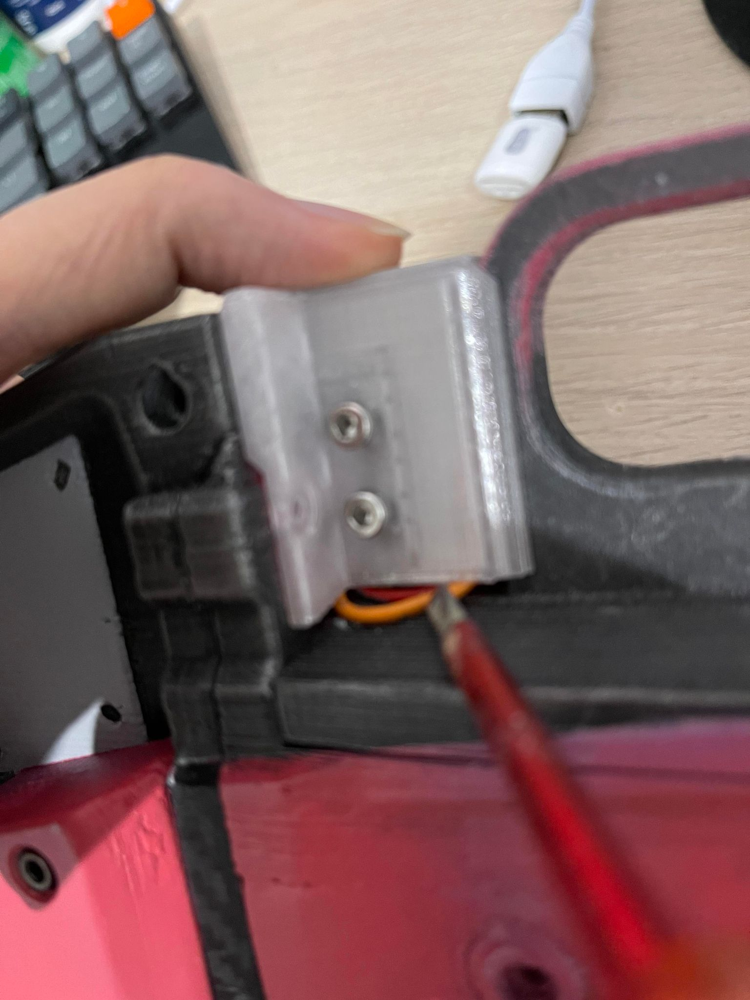
    
Stuff wires into block, then push down block while poking wires in.

Then I bolted the holder/bracket to the blaster body with a 2x M3x8 SHSC.

    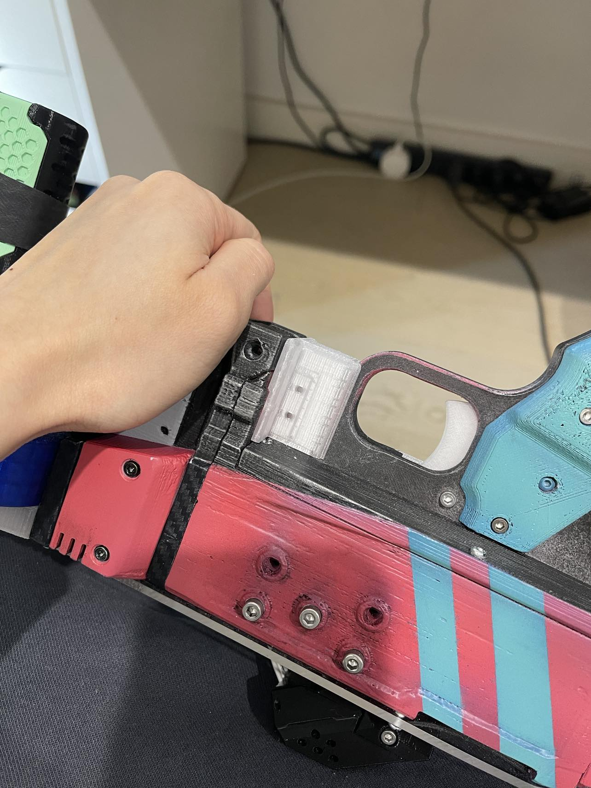
    
Mag release block bolted in

#### 3.4.4 Stock

    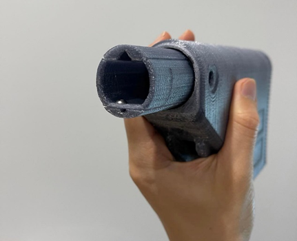
    
Failed charging handle component

I was too lazy to drive to the hardware store and get my hands on tubing, so I threw together some prints. Note that I wanted to print it lengthways to avoid layer separation issues.

## 4. Wiring
Remember to complete the assembly prior to the wiring. Unfortunately swapping out printed components after soldering wasn't a consideration when I was CAD-ing the various parts of the shell.

Once you've completed all the assembly and test-fits (this includes the electronics), thread the wires through the shell before you start soldering.

    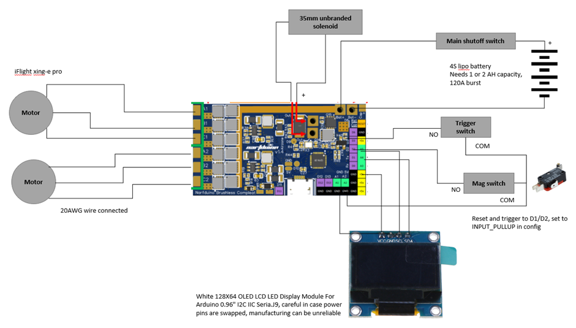
    
Blaster circuit diagram

Note: Careful about which version of the Narfduino Compleat board you have – the v1.2 and v1.4 have slightly different pinouts. 

    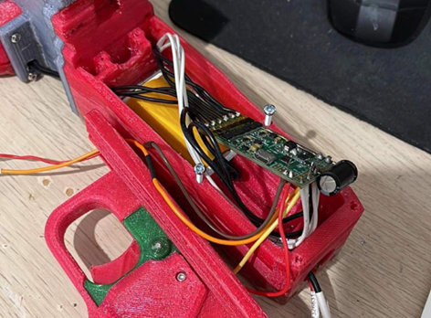
    
Soldered Narfduino compleat

## 5. Programming
### 5.1 Installation
Airzone’s website contains instructions for uploading software in the “getting started” tab. https://blastersbyairzone.com 
Note: If you’re using the Narfduino v1.4, you may need to install certain board managers: https://mcudude.github.io/MiniCore/package_MCUdude_MiniCore_index.json (Install the MiniCore board)
 

    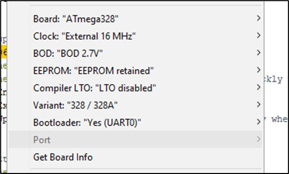
    
Arduino Upload board settings

### 5.2 My software:
If the following link doesn't work, the software should be somewhere in this repository.
Link to my software (Upload using Airzone’s instructions): https://github.com/GrubbyLittleRaccoon/QT19-T19E1-derivative/tree/main/qt19%20controller%20software 

This is based on the Airzone’s NBC library, it’s intended as a 2-round burst functionality, with the usual “wait for motor to rev up” functionality that the NBC library creates from Toruk’s Flyshot SimonK implementation. It also controls the OLED board with a 15-round ammo counter (reset on mag change).

Note that certain previous commits featured a dynamic crosshair (expands on firing, retracts slowly, influenced by popular FPS game design), but without sourcing a proper reflective parabolic lens and corresponding closed scope design, this is pretty pointless. Some of these older commits do have issues with debounced inputs distinguishing between rising and falling edges, though.

Note to self: The solenoid timing is statically set, and has trouble firing darts through around the 11.15V mark for my specific setup. Consider making the solenoid firing delay voltage-dependent i.e. give less time to fire at high voltages.

## 6. Issues/abandoned parts
### HUD sight
I initially programmed the screen output to act as a HUD sight with a dynamic crosshair and ammo counter, but this ended up not being bright enough in outdoor games without specialised sight lenses. These lenses (With potentially red-dot style sight placement!) seem available on AliExpress in varying questionable sizings, and sufficient shrouding might help with outdoor visibility, so there might actually exist a reasonable solution! For now, however, I'm shelving this idea and just sticking with a simple display and relying on other sights.

  

    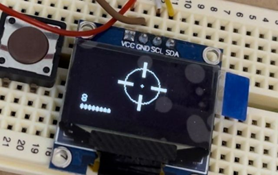
    
Left: WIP of screen, clearer shot

  

  

    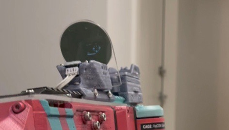
    
Right: Implementation of HUD

  

### Reciprocating charging handle
I intended for the solenoid introduction to allow for the addition of a reciprocating charging handle (purely aesthetic). I ended up removing it from my build because it didn’t quite work as well as I’d hoped, but the files and the slot at the side of the receiver still exist.

    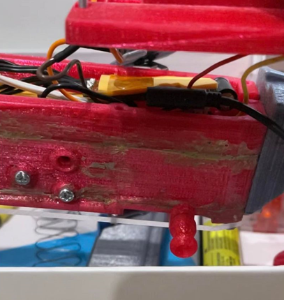
    
Failed charging handle component

### Solenoid mounting hole alignment
I messed this up which is why I only have 3 M3 SHSC in each side in some pictures, not sure if I've fixed it in later iterations

### File cleanup
IMO the files could be cleaned up somewhat:
- The slot for the faux charging handle could be removed for printability
- Top plate files need to be revisited since I used acrylic sheet instead
- The files could be changed to be able to disassemble them after soldering electronics, it's a bit silly that you can't do that with my design.
- The side covers aren't great for accomodating the M3 SHCS heads, we need design in more space.
- The software for the display could probably be a little more modular

## 7. End notes
If there's anything I've missed, feel free to ping me (and maybe look through my other designs) at:
- https://www.thingiverse.com/j_yang/designs
- https://www.printables.com/@grubbyraccoo_1180892

And if you'd like to help me justify spending time making more free designs… https://www.buymeacoffee.com/Jyang